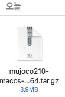

# Pytorch Tutorial for DQN

This repo is following [pytorch tutorial for DQN](https://pytorch.org/tutorials/intermediate/reinforcement_q_learning.html)

## setting up

When making a python project, I usually make`virtual env` to save all the packages. However, since `pytorch` and `gym` is going to be used always, I'll install it without using `virtual env`.

Making sure I'm using `conda env`

```bash
conda activate
```

### installing pytorch via conda

https://pytorch.org/get-started/locally/

```bash
(base) conda install pytorch torchvision torchaudio -c pytorch
```

### installing gym via pip

```bash
(base) pip install 'gym[all]'
```

Recieved error as such

```bash
  Building wheel for mujoco-py (setup.py) ... error
  ERROR: Command errored out with exit status 1:
   command: /Users/duru/opt/anaconda3/bin/python -u -c 'import sys, setuptools, tokenize; sys.argv[0] = '"'"'/private/var/folders/5c/9188r1jd63j6pwd866vc1gpc0000gq/T/pip-install-bjgsbve7/mujoco-py/setup.py'"'"'; __file__='"'"'/private/var/folders/5c/9188r1jd63j6pwd866vc1gpc0000gq/T/pip-install-bjgsbve7/mujoco-py/setup.py'"'"';f=getattr(tokenize, '"'"'open'"'"', open)(__file__);code=f.read().replace('"'"'\r\n'"'"', '"'"'\n'"'"');f.close();exec(compile(code, __file__, '"'"'exec'"'"'))' bdist_wheel -d /private/var/folders/5c/9188r1jd63j6pwd866vc1gpc0000gq/T/pip-wheel-dn5l1lvq
       cwd: /private/var/folders/5c/9188r1jd63j6pwd866vc1gpc0000gq/T/pip-install-bjgsbve7/mujoco-py/
  Complete output (27 lines):
  running bdist_wheel
  running build
  Traceback (most recent call last):
    File "<string>", line 1, in <module>
    File "/private/var/folders/5c/9188r1jd63j6pwd866vc1gpc0000gq/T/pip-install-bjgsbve7/mujoco-py/setup.py", line 32, in <module>
      setup(
    File "/Users/duru/opt/anaconda3/lib/python3.8/site-packages/setuptools/__init__.py", line 153, in setup
      return distutils.core.setup(**attrs)
    File "/Users/duru/opt/anaconda3/lib/python3.8/distutils/core.py", line 148, in setup
      dist.run_commands()
    File "/Users/duru/opt/anaconda3/lib/python3.8/distutils/dist.py", line 966, in run_commands
      self.run_command(cmd)
    File "/Users/duru/opt/anaconda3/lib/python3.8/distutils/dist.py", line 985, in run_command
      cmd_obj.run()
    File "/Users/duru/opt/anaconda3/lib/python3.8/site-packages/wheel/bdist_wheel.py", line 290, in run
      self.run_command('build')
    File "/Users/duru/opt/anaconda3/lib/python3.8/distutils/cmd.py", line 313, in run_command
      self.distribution.run_command(command)
    File "/Users/duru/opt/anaconda3/lib/python3.8/distutils/dist.py", line 985, in run_command
      cmd_obj.run()
    File "/private/var/folders/5c/9188r1jd63j6pwd866vc1gpc0000gq/T/pip-install-bjgsbve7/mujoco-py/setup.py", line 28, in run
      import mujoco_py  # noqa: force build
    File "/private/var/folders/5c/9188r1jd63j6pwd866vc1gpc0000gq/T/pip-install-bjgsbve7/mujoco-py/mujoco_py/__init__.py", line 3, in <module>
      from mujoco_py.builder import cymj, ignore_mujoco_warnings, functions, MujocoException
    File "/private/var/folders/5c/9188r1jd63j6pwd866vc1gpc0000gq/T/pip-install-bjgsbve7/mujoco-py/mujoco_py/builder.py", line 20, in <module>
      from lockfile import LockFile
  ModuleNotFoundError: No module named 'lockfile'
  ----------------------------------------
  ERROR: Failed building wheel for mujoco-py
  Running setup.py clean for mujoco-py
Successfully built box2d-py
Failed to build mujoco-py
Installing collected packages: lz4, importlib-resources, ale-py, box2d-py, opencv-python, pyglet, glfw, lockfile, mujoco-py
    Running setup.py install for mujoco-py ... error
    ERROR: Command errored out with exit status 1:
     command: /Users/duru/opt/anaconda3/bin/python -u -c 'import sys, setuptools, tokenize; sys.argv[0] = '"'"'/private/var/folders/5c/9188r1jd63j6pwd866vc1gpc0000gq/T/pip-install-bjgsbve7/mujoco-py/setup.py'"'"'; __file__='"'"'/private/var/folders/5c/9188r1jd63j6pwd866vc1gpc0000gq/T/pip-install-bjgsbve7/mujoco-py/setup.py'"'"';f=getattr(tokenize, '"'"'open'"'"', open)(__file__);code=f.read().replace('"'"'\r\n'"'"', '"'"'\n'"'"');f.close();exec(compile(code, __file__, '"'"'exec'"'"'))' install --record /private/var/folders/5c/9188r1jd63j6pwd866vc1gpc0000gq/T/pip-record-0cypujx6/install-record.txt --single-version-externally-managed --compile --install-headers /Users/duru/opt/anaconda3/include/python3.8/mujoco-py
         cwd: /private/var/folders/5c/9188r1jd63j6pwd866vc1gpc0000gq/T/pip-install-bjgsbve7/mujoco-py/
    Complete output (56 lines):
    running install
    running build

    You appear to be missing MuJoCo.  We expected to find the file here: /Users/duru/.mujoco/mjpro150

    This package only provides python bindings, the library must be installed separately.

    Please follow the instructions on the README to install MuJoCo

        https://github.com/openai/mujoco-py#install-mujoco

    Which can be downloaded from the website

        https://www.roboti.us/index.html

    Traceback (most recent call last):
      File "<string>", line 1, in <module>
      File "/private/var/folders/5c/9188r1jd63j6pwd866vc1gpc0000gq/T/pip-install-bjgsbve7/mujoco-py/setup.py", line 32, in <module>
        setup(
      File "/Users/duru/opt/anaconda3/lib/python3.8/site-packages/setuptools/__init__.py", line 153, in setup
        return distutils.core.setup(**attrs)
      File "/Users/duru/opt/anaconda3/lib/python3.8/distutils/core.py", line 148, in setup
        dist.run_commands()
      File "/Users/duru/opt/anaconda3/lib/python3.8/distutils/dist.py", line 966, in run_commands
        self.run_command(cmd)
      File "/Users/duru/opt/anaconda3/lib/python3.8/distutils/dist.py", line 985, in run_command
        cmd_obj.run()
      File "/Users/duru/opt/anaconda3/lib/python3.8/site-packages/setuptools/command/install.py", line 61, in run
        return orig.install.run(self)
      File "/Users/duru/opt/anaconda3/lib/python3.8/distutils/command/install.py", line 545, in run
        self.run_command('build')
      File "/Users/duru/opt/anaconda3/lib/python3.8/distutils/cmd.py", line 313, in run_command
        self.distribution.run_command(command)
      File "/Users/duru/opt/anaconda3/lib/python3.8/distutils/dist.py", line 985, in run_command
        cmd_obj.run()
      File "/private/var/folders/5c/9188r1jd63j6pwd866vc1gpc0000gq/T/pip-install-bjgsbve7/mujoco-py/setup.py", line 28, in run
        import mujoco_py  # noqa: force build
      File "/private/var/folders/5c/9188r1jd63j6pwd866vc1gpc0000gq/T/pip-install-bjgsbve7/mujoco-py/mujoco_py/__init__.py", line 3, in <module>
        from mujoco_py.builder import cymj, ignore_mujoco_warnings, functions, MujocoException
      File "/private/var/folders/5c/9188r1jd63j6pwd866vc1gpc0000gq/T/pip-install-bjgsbve7/mujoco-py/mujoco_py/builder.py", line 502, in <module>
        mjpro_path, key_path = discover_mujoco()
      File "/private/var/folders/5c/9188r1jd63j6pwd866vc1gpc0000gq/T/pip-install-bjgsbve7/mujoco-py/mujoco_py/utils.py", line 93, in discover_mujoco
        raise Exception(message)
    Exception:
    You appear to be missing MuJoCo.  We expected to find the file here: /Users/duru/.mujoco/mjpro150

    This package only provides python bindings, the library must be installed separately.

    Please follow the instructions on the README to install MuJoCo

        https://github.com/openai/mujoco-py#install-mujoco

    Which can be downloaded from the website

        https://www.roboti.us/index.html

    ----------------------------------------
ERROR: Command errored out with exit status 1: /Users/duru/opt/anaconda3/bin/python -u -c 'import sys, setuptools, tokenize; sys.argv[0] = '"'"'/private/var/folders/5c/9188r1jd63j6pwd866vc1gpc0000gq/T/pip-install-bjgsbve7/mujoco-py/setup.py'"'"'; __file__='"'"'/private/var/folders/5c/9188r1jd63j6pwd866vc1gpc0000gq/T/pip-install-bjgsbve7/mujoco-py/setup.py'"'"';f=getattr(tokenize, '"'"'open'"'"', open)(__file__);code=f.read().replace('"'"'\r\n'"'"', '"'"'\n'"'"');f.close();exec(compile(code, __file__, '"'"'exec'"'"'))' install --record /private/var/folders/5c/9188r1jd63j6pwd866vc1gpc0000gq/T/pip-record-0cypujx6/install-record.txt --single-version-externally-managed --compile --install-headers /Users/duru/opt/anaconda3/include/python3.8/mujoco-py Check the logs for full command output.
```

So I followed what is on https://github.com/openai/mujoco-py#install-mujoco

### installing mujoco

1. Download the MuJoCo version 2.1 binaries for OSX.



2. Extract it.


3. Move the extracted folder to `~/.mujoco/mujoco210`

```bash
(base) ➜  ~ mkdir .mujoco
(base) ➜  ~ mv Downloads/mujoco210 .mujoco/mujoco210
```

4. pip install mujoco

```bash
(base) ➜  ~ pip3 install -U 'mujoco-py<2.2,>=2.1'
```


However even after installing mujoco, following the code below which is from the [official github](https://github.com/openai/mujoco-py#install-mujoco) still cause error, but I'll get to that later. (importing is causing error)

```python
import mujoco_py
import os
mj_path = mujoco_py.utils.discover_mujoco()
xml_path = os.path.join(mj_path, 'model', 'humanoid.xml')
model = mujoco_py.load_model_from_path(xml_path)
sim = mujoco_py.MjSim(model)

print(sim.data.qpos)
# [0. 0. 0. 0. 0. 0. 0. 0. 0. 0. 0. 0. 0. 0. 0. 0. 0. 0. 0. 0. 0.]

sim.step()
print(sim.data.qpos)
# [-2.09531783e-19  2.72130735e-05  6.14480786e-22 -3.45474715e-06
#   7.42993721e-06 -1.40711141e-04 -3.04253586e-04 -2.07559344e-04
#   8.50646247e-05 -3.45474715e-06  7.42993721e-06 -1.40711141e-04
#  -3.04253586e-04 -2.07559344e-04 -8.50646247e-05  1.11317030e-04
#  -7.03465386e-05 -2.22862221e-05 -1.11317030e-04  7.03465386e-05
#  -2.22862221e-05]
```


Anyway, I followed the DQN tutorial and recorded it in `pytorch_dqn.ipynb`.